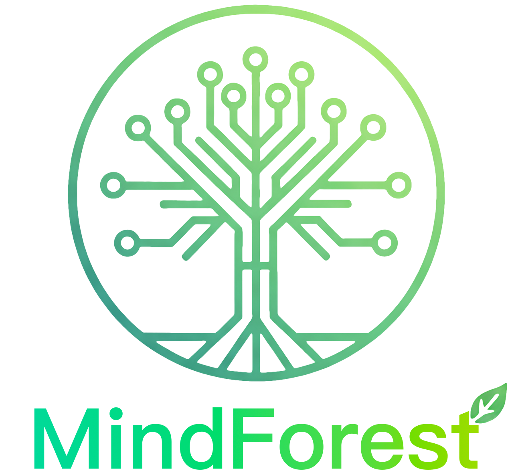

<div align="center">




English | [简体中文](README.zh-CN.md)

</div>

MindForest is a dual-layer visual knowledge workspace: the Tree View helps you dive deep into a topic while the Graph View exposes cross-topic relations. The app blends trees, graph canvas, and a Markdown editor so you can grow and reorganize your forest of ideas with an immersive flow.

**Current version:** 0.1.0-alpha · See [CHANGELOG.md](CHANGELOG.md) for updates.

## 🚀 Quick start (desktop app is primary)

The desktop app bundles the Rust API and SQLite; the backend is **required**.

1. Build/export the frontend (Execute from root directory):
   ```bash
   npm run build
   rm -rf rust-mindforest/apps/.tauri-dist
   mkdir -p rust-mindforest/apps/.tauri-dist
   cp -R out/* rust-mindforest/apps/.tauri-dist
   ```
2. Package or run the desktop app:
   ```bash
   cd rust-mindforest/apps/desktop
   cargo tauri build        # packaged app
   # or cargo tauri dev     # live dev (expects Next dev at :13000)
   ```
3. Launch the app. It auto-starts the Rust API on `127.0.0.1:8787`, waits for it, then picks an existing topic or creates “My Forest”. Data is stored in SQLite at `~/Library/Application Support/com.mindforest.desktop/mindforest.db` (or `DATABASE_URL`).

DevTools (when needed): run the app with `TAURI_DEVTOOLS=1 .../MindForest.app/Contents/MacOS/desktop`, then `⌥+⌘+I`.

**Gatekeeper note (macOS, unsigned builds)**: if you see “app is damaged” on first open, remove quarantine:
```bash
xattr -dr com.apple.quarantine /Applications/MindForest.app
# or on the DMG before mounting: xattr -dr com.apple.quarantine MindForest.dmg
```

## ✨ Core Features

- **Tree ↔ Graph toggle** – The bottom dock (Framer Motion) switches between `TreeLayer` (orbital layout around the focus node) and `GraphLayer` (react-force-graph-2d).
- **Node authoring panel** – `NodeEditorPanel` provides node deletion, child addition, inline breadcrumbs, Write/Read toggle, back/forward navigation history, clickable connection chips, and a dropdown connection picker.
- **Local persistence** – Zustand with `persist` stores the forest in `localStorage`, enabling offline edits.
- **Expressive motion language** – Tailwind CSS v4 plus a custom forest palette (`src/app/globals.css`) delivers glassmorphism, glow, and film-grain accents.
- **Extensible data model** – `ForestNode` tracks both hierarchical `children` and semantic `links`, paving the way for multiple layouts and syncing strategies.


## 🧱 Tech Stack

- **Frontend**: Next.js 16 App Router, React 19, TypeScript  
- **State**: Zustand + Immer + uuid  
- **Animation & Canvas**: Framer Motion, react-force-graph-2d  
- **UI utilities**: Tailwind CSS 4, tailwind-merge, lucide-react, React Markdown, react-textarea-autosize


## 📁 Project Structure

```
rust-mindforest/         # Rust workspace: domain, storage (memory/postgres/sqlite), API, desktop
  ├─ crates/             # domain + storage implementations
  ├─ apps/api/           # Axum HTTP API (topics/nodes)
  └─ apps/desktop/       # Tauri desktop wrapper (bundles API + SQLite)
src/
 ├─ app/                 # App Router (layout.tsx, page.tsx, global styles)
 ├─ components/
 │   └─ workspace/       # TreeLayer · GraphLayer · WorkspaceShell · NodeEditorPanel
 ├─ hooks/               # Shared hooks (useDebounce)
 ├─ store/               # Zustand slices (useForestStore)
 └─ types/               # Shared interfaces (forest.ts)
public/                  # Static assets & previews
```


## 🧭 Workspace Highlights

| Area | Description |
| --- | --- |
| `src/components/workspace/WorkspaceShell.tsx` | Client entry point that manages the dock, view toggles, sidebar animation, and layer composition. |
| `TreeLayer.tsx` | Bubble tree view that uses Framer Motion `layoutId` for seamless scaling, hover states, and parent breadcrumbs. |
| `GraphLayer.tsx` | Force-directed graph with responsive sizing, automatic focus/offset handling when the sidebar is open, and custom canvas rendering. |
| `NodeEditorPanel.tsx` | Inline breadcrumb path, Write/Read toggle, back/forward navigation controls, clickable connection chips, dropdown link picker, metadata, and debounced saves. |
| `useForestDataStore.ts` / `useWorkspaceUIStore.ts` | Nodes CRUD + persistence, plus UI state for focus/view/sidebar and navigation history (`goToNode`, `goBack`, `goForward`). |


## 🚀 Getting Started

1. **Install dependencies**
   ```bash
   npm install
   # or pnpm install
   ```
2. **Start the Rust API (required for real data)**
   ```bash
   cd rust-mindforest
   DATABASE_URL="sqlite://$HOME/Library/Application Support/com.mindforest.desktop/mindforest.db" \
   API_ADDR=127.0.0.1:8787 \
   cargo run -p api
   ```
3. **Local frontend development**
   ```bash
   npm run dev
   # or pnpm dev
   ```
   Visit `http://localhost:13000` to see `WorkspaceShell`.
4. **Production build / preview**
   ```bash
   npm run build
   npm run start   # Run the prod server locally before releases
   # or pnpm build / pnpm start
   ```
5. **Quality gates**
   ```bash
   npm run lint    # ESLint + Next.js Core Web Vitals
   # or pnpm lint
   ```

> Use Node 18+ and make sure dev server, build, and lint pass before committing.

## 🔗 Backend (required)
- The Rust API is mandatory; the desktop app runs it in-process on `127.0.0.1:8787` and the frontend points there by default.
- If you prefer to run the API standalone (e.g., Postgres), start it from `rust-mindforest` (see its README) and set:
  - `NEXT_PUBLIC_API_BASE_URL=http://127.0.0.1:8787` (or your port)
- The workspace hydrates from the remote topic on load and mirrors edits (add/update/delete/link) back to the API; stale IDs are cleared automatically on 404s.


## 🗂️ Data & State

- `ForestNode` (`src/types/forest.ts`) keeps both `children` (tree) and `links` (graph) references; `type` currently supports `concept | fact | source | question`.
- `useForestDataStore` exposes:
  - `nodes`, `rootNodeId`
  - `addNode`, `updateNodeTitle`, `updateNodeContent`
- `useWorkspaceUIStore` handles UI/focus:
  - `focusedNodeId`, `viewMode`, `isSidebarOpen`, navigation stacks
  - `goToNode`, `goBack`, `goForward`, `toggleView`, `toggleSidebar`, `hydrateEditorDraft`
- `persist` only saves the data layer (`nodes`, `rootNodeId`) to keep UI state predictable after refresh.

## 🗺️ Roadmap (excerpt)

1. **MVP**
   - Node CRUD, Tree View, focus transitions, local persistence
2. **Alpha**
   - Enhanced Graph View, accounts, cloud sync, bulletin board
3. **Beta**
   - Multiple layouts (Pythagorean / Radial / Flow), AI assistant, community features (Fork / Upvote / Learning Paths)


## 🤝 Contribution Guide

1. Branch from `main` and keep a clean rebase history.  
2. Write present-tense commits (e.g., `feat: expand node inspector`) and list build/lint/test status plus screenshots in PRs.  
3. Attach interaction videos or screenshots for UI work; flag breaking changes explicitly.

Let’s keep growing the MindForest together. 🌿
